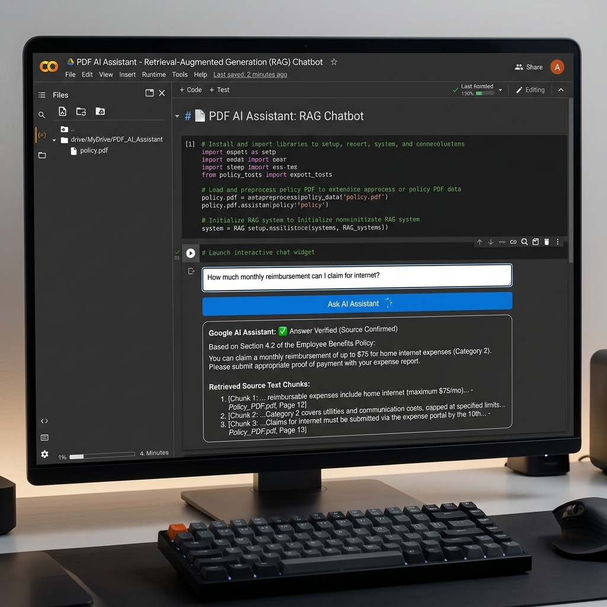
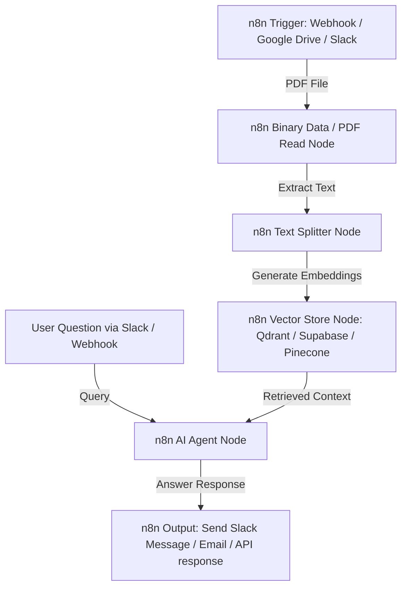

# 📄 PDF AI Assistant (Retrieval-Augmented Generation - RAG Chatbot)

This repository contains a self-contained, production-grade Google Colab notebook for building an **Interactive PDF Q&A Chatbot** using local **Retrieval-Augmented Generation (RAG)** pipelines.

The system allows users to upload any PDF document, break it down into semantic chunks, index it in a high-performance vector store, and query it using natural language. The local Large Language Model answers questions based **only** on the retrieved context, eliminating hallucinations.

---

## 🌟 Key Features

1. **Local Quantized LLM**:
   - Uses `Qwen/Qwen2.5-1.5B-Instruct` loaded on Colab's GPU using half-precision (`float16`) for extremely fast and high-quality responses.
2. **Offline Vector Search**:
   - Uses Hugging Face's `all-MiniLM-L6-v2` embeddings (384-dimensional dense vectors) to capture semantic meanings of text.
   - Employs **FAISS (Facebook AI Similarity Search)** as a fast, in-memory vector store for chunk retrieval.
3. **Out-of-the-box Execution**:
   - Generates a synthetic 3-page policy handbook (`indian_company_policy.pdf`) using Python's `reportlab` inside the notebook, allowing you to run and test it immediately without needing to upload external files.
4. **Interactive Chat Console**:
   - Renders a styled HTML interface inside the Colab cell output using `ipywidgets`. It displays AI responses alongside **numbered source page references** retrieved from the PDF.
5. **No-Cost Setup**:
   - Runs 100% locally on Colab's T4 GPU. No OpenAI/Anthropic API keys or paid tokens are required!

---

## 🚀 How to Run in Google Colab

1. **Download** the notebook file: [`PDF_AI_Assistant_RAG.ipynb`](PDF_AI_Assistant_RAG.ipynb).
2. **Open** [Google Colab](https://colab.research.google.com/).
3. **Upload** the notebook (`File > Upload notebook`).
4. **Enable GPU**:
   - Click `Runtime > Change runtime type` in the top menu.
   - Under *Hardware accelerator*, select **T4 GPU**.
5. **Execute all cells** (`Runtime > Run all`).

---

## 📊 RAG Pipeline Architecture

```text
  [ PDF Document ]
         │
         ▼ (pypdf Loader)
   [ Full Text ]
         │
         ▼ (Recursive Character Splitter)
  [ Text Chunks ] ──► (sentence-transformers Embeddings) ──► [ FAISS Vector Store ]
                                                                     ▲
                                                                     │ (Query Retrieval)
  [ User Question ] ─────────────────────────────────────────────────┼
         │                                                           │
         ▼                                                           ▼
 [ Prompt Template ] ◄──────────────────────────────────────── [ Top-k Context ]
         │
         ▼
[ Quantized LLM (Qwen) ] ──► [ Verified Answer + Sources ]
```

---

## 📸 Notebook Interface Preview

Here is a visual preview of the Google Colab Notebook interface and execution outputs:



---

## 📁 Repository Structure

```text
├── PDF_AI_Assistant_RAG.ipynb  # Main Google Colab Jupyter Notebook
├── generate_notebook.py        # Python builder script to compile the notebook
├── README.md                   # Project documentation
└── .gitignore                  # Git exclusion rules
```

---

## 🤖 n8n Workflow Automation Integration (Optional)

You can easily scale this PDF RAG Assistant into a fully automated enterprise workflow using **n8n**. This allows you to automatically ingest PDFs from Google Drive, Slack, or Email, run the RAG pipeline, and deliver responses to your team.

### n8n Automation Architecture


### Steps to implement in n8n:
1. **Trigger**: Use a `Webhook` or `Google Drive (On File Added)` node to detect new PDF uploads.
2. **Document Loading**: Use the `Read Binary File` node to extract PDF metadata and text content.
3. **Vector Database**: Connect a `Vector Store` node (e.g., **Supabase Vector**, **Qdrant**, or **Pinecone**) and pair it with an **Embeddings** model node (like OpenAI Embeddings or Hugging Face Inference API).
4. **AI Agent**: Create an `AI Agent` node, assign it a chat model (e.g., OpenAI GPT-4o or Claude 3.5), and connect the Vector Store as a `Retriever Tool`.
5. **Output**: Use a `Slack` or `Gmail` node to automatically send the generated response back to the user.

---

## 🛠️ Local Installation (Optional)

To run the builder script locally:
```bash
pip install -r requirements.txt
```
*(Dependencies within the notebook cells are installed automatically during Colab execution).*

---

## 📜 License
This project is open-source and licensed under the [MIT License](LICENSE).
