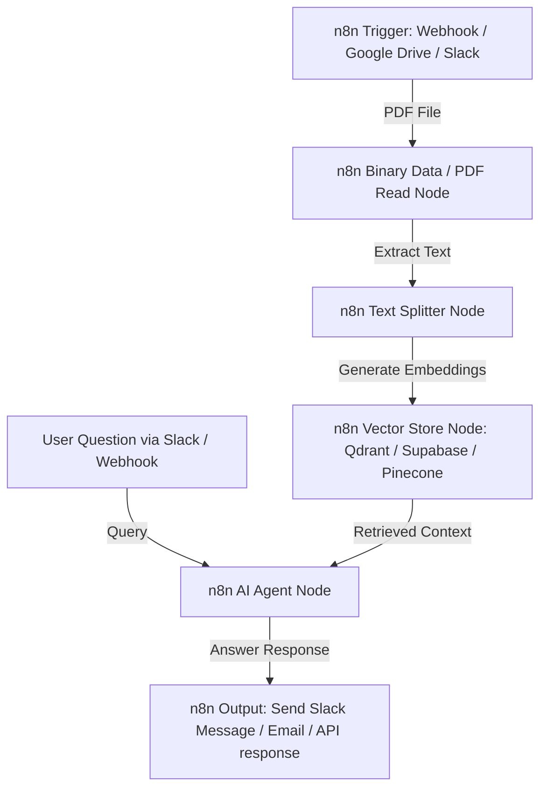

# 📄 PDF AI Assistant (Interactive RAG Chatbot)

[](LICENSE)
[](https://www.python.org/)
[](https://huggingface.co/spaces)
[](https://n8n.io/)

A production-grade, high-performance **Retrieval-Augmented Generation (RAG)** chatbot that allows users to upload any PDF document, break it down into semantic chunks, index it, and query it using natural language. 

The chatbot utilizes local Large Language Models (LLMs) and vector search engines to generate highly accurate responses based **only** on the retrieved document context, completely eliminating AI hallucinations.

---

## 📸 Interface Preview

Here is a visual preview of the Google Colab Notebook interface and execution outputs:


---

## 🌟 Key Features

* 🚀 **Multi-UI In-Box Deployments**: Supports execution via **Google Colab (Interactive ipywidgets)**, **Streamlit (Web App)**, and **Gradio (Hugging Face Spaces)**.
* 🤖 **Local Quantized LLM**: Leverages `Qwen/Qwen2.5-1.5B-Instruct` loaded in half-precision (`float16`) on a T4 GPU for ultra-fast, local inference.
* 🔍 **Semantic Offline Search**: Uses Hugging Face's `all-MiniLM-L6-v2` embeddings combined with **FAISS (Facebook AI Similarity Search)** as an in-memory vector store.
* 📄 **Auto-Generated Test Document**: Dynamically builds a synthetic 3-page corporate policy handbook (`indian_company_policy.pdf`) using `reportlab` for instant, out-of-the-box testing.
* 📝 **Source Attribution**: AI responses display exact matching source page numbers, keeping the model accountable.
* ⚡ **Zero-Cost Setup**: 100% open-source and local. No OpenAI/Anthropic API keys required!

---

## 📊 RAG Pipeline Architecture

```text
  [ PDF Document ]
         │
         ▼ (pypdf Loader)
   [ Full Text ]
         │
         ▼ (Recursive Character Splitter)
  [ Text Chunks ] ──► (sentence-transformers Embeddings) ──► [ FAISS Vector Store ]
                                                                     ▲
                                                                     │ (Query Retrieval)
  [ User Question ] ─────────────────────────────────────────────────┼
         │                                                           │
         ▼                                                           ▼
 [ Prompt Template ] ◄──────────────────────────────────────── [ Top-k Context ]
         │
         ▼
[ Quantized LLM (Qwen) ] ──► [ Verified Answer + Source Pages ]
```

---

## 🚀 Execution & Deployment Options

### Option A: Google Colab (Recommended for Instant Setup)
1. **Download** the notebook file: [`PDF_AI_Assistant_RAG.ipynb`](PDF_AI_Assistant_RAG.ipynb).
2. **Open** [Google Colab](https://colab.research.google.com/).
3. **Upload** the notebook (`File > Upload notebook`).
4. **Enable GPU**: Go to `Runtime > Change runtime type` and select **T4 GPU**.
5. **Run all cells** (`Runtime > Run all`).

### Option B: Local Web Interface (Streamlit)
To run the interactive RAG interface locally:
```bash
# Clone the repository
git clone https://github.com/Rafiaminhaj/-pdf-ai-assistant.git
cd -pdf-ai-assistant

# Install dependencies
pip install -r requirements.txt

# Start the Streamlit app
streamlit run app_rag.py
```

### Option C: Hugging Face Spaces (Gradio SDK)
Deploy the chatbot directly to Hugging Face Spaces using the Gradio setup:
* Create a new Hugging Face Space using the **Gradio SDK**.
* Upload `app_gradio.py` as `app.py`, along with `requirements.txt`.
* The space will compile and host your PDF Q&A assistant automatically.

---

## 🤖 n8n Workflow Automation Integration (Optional)

You can easily scale this PDF RAG Assistant into a fully automated enterprise workflow using **n8n**. This allows you to automatically ingest PDFs from Google Drive, Slack, or Email, run the RAG pipeline, and deliver responses to your team.

### n8n Automation Architecture


### Steps to implement in n8n:
1. **Trigger**: Use a `Webhook` or `Google Drive (On File Added)` node to detect new PDF uploads.
2. **Document Loading**: Use the `Read Binary File` node to extract PDF metadata and text content.
3. **Vector Database**: Connect a `Vector Store` node (e.g., **Supabase Vector**, **Qdrant**, or **Pinecone**) and pair it with an **Embeddings** model node (like OpenAI Embeddings or Hugging Face Inference API).
4. **AI Agent**: Create an `AI Agent` node, assign it a chat model (e.g., OpenAI GPT-4o or Claude 3.5), and connect the Vector Store as a `Retriever Tool`.
5. **Output**: Use a `Slack` or `Gmail` node to automatically send the generated response back to the user.

---

## 📁 Repository Structure

```text
├── PDF_AI_Assistant_RAG.ipynb  # Google Colab Notebook
├── generate_notebook.py        # Python builder script to compile the notebook
├── app_rag.py                  # Local Streamlit application entrypoint
├── app_gradio.py               # Gradio application optimized for Hugging Face
├── deploy_guide.md             # Multi-UI deployment documentation
├── screenshots/
│   └── preview.png             # Visual preview of the notebook UI
├── requirements.txt            # System dependencies
└── README.md                   # Project documentation
```

---

## 📜 License

This project is open-source and licensed under the [MIT License](LICENSE).
